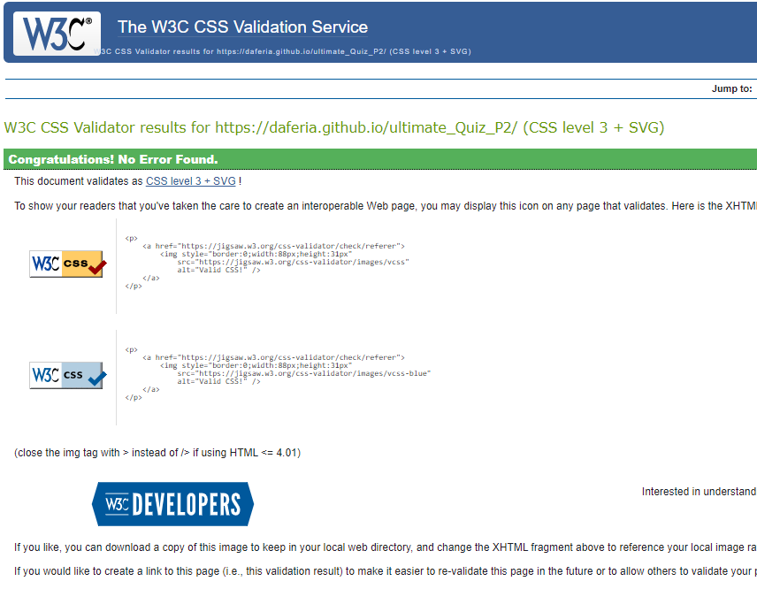

# The Ultimate Quiz

# The Goal for this Project

The goal of the project is to keep users entertained and at the same time, get them to test their general knowledge through a variety of different questions. The project was inspired by our company’s Pub Quiz nights and the struggle to find a good free application.

# Table of Contents

+ [UX](#ux "UX")
    + [User Goals](#user-goals "User Goals")
    + [User Stories](#user-stories "User Stories")
    + [Requirements](#requirements)
    + [Design Choices](#design-choices)
        + [Fonts](#fonts)
        + [Icons](#icons)
        + [Colours](#colours)
        + [Structure](#structure)
        + [Responsive Displays](#responsive-displays)
        + [Wireframes](#wireframes)
    + [Features](#features)
        + [Existing Features](#existing-features)
        + [Future Features](#future-features)
    + [Technologies used](#technologies-used)
        + [Languages](#languages)
        + [Tools and Libraries](#tools-and-libraries)
    + [Testing](#testing)
        + [Unfixed Bugs](#unfixed-bugs)
    + [Deployment](#deployment)
    + [Credits](#credits)

# UX

## User Goals

+ Provide a good amount of variety of questions
+ Easy to navigate and use
+ Provide different colour options
+ Get the user to learn while in the quiz by providing them with the correct answers
+ Create a quiz that is visually appealing to the user.

## User Stories

+ As a User, I want the user to be engaged in the quiz
+ As a User, I want them to feel challenged as well as provide enjoyment during play
+ As a User, I want to be able to see my results after playing the game.
+ As a User, I want to play a quiz intuitively.
+ As a User, I expect the users to come back to improve their score

## Requirements

+ Needs to work on any device and browser
+ Able to generate the questions without fail or try not to duplicate questions
+ Allow the user to change to a dark theme or light theme

\
&nbsp;
[Back to Top](#table-of-contents)
\
&nbsp;

# Design Choices

## Fonts
I have used [Google Fonts](https://fonts.google.com/ "Google Fonts") to find a text that best suits the feel of the website.
I have used? for most of the site.

## Icons
I have chosen to use the amazing icons supplied from [Font Awesome library](https://fontawesome.com/ "Font Awesome"). These icons are easy to interpret and are free to use on the website

## Colours

I used [Coolors](https://coolors.co/ "Coolors") to generate the colour palette.
All variable colours were chosen with the point to be able to quickly be able to make changes as needed.
Any other general RGB colours in the CSS are to stay as is and only the variable are planned to be changed if need be.

All variable colours are as follows:

  ### General colours used

  * --white: rgb(255, 255, 255);
  * --light-gray: rgb(206, 212, 218);
  * --sonic-silver: rgb(108, 117, 125);

    

  ### Dark theme colours

  * --davys-grey: rgb(74, 80, 87);
  * --onyx: rgb(52, 58, 64);
  * --charleston-green: rgb(34, 38, 42);

  

  ### Default (light) theme

  * --pacific-blue: rgb(84, 176, 189);
  * --alice-blue: rgb(240, 248, 255);
  * --turquoise: rgb(102, 222, 208);
  * --sky-blue-crayola: rgb(107, 219, 233);
  * --maya-blue: rgb(132, 197, 254);

  
\
&nbsp;

## Structure

### Start Screen

\
&nbsp;

### Rules

\
&nbsp;

### Questions, game modes, Answers and Counter

\
&nbsp;

### Results

\
&nbsp;

[Back to Top](#table-of-contents)
\
&nbsp;

## Responsive Displays

### Start Screen

\
&nbsp;

### Rules

\
&nbsp;

### Questions, game modes, Answers and Counter

\
&nbsp;

### Results

\
&nbsp;

[Back to Top](#table-of-contents)
\
&nbsp;

## Wireframes

### Start Screen

\
&nbsp;

### Rules

\
&nbsp;

### Questions, game modes, Answers and Counter

\
&nbsp;

### Results

\
&nbsp;

[Back to Top](#table-of-contents)
\
&nbsp;

# Features

+ Allow the user to select between light and dark themes and saving that choice to local
+ Highlights the correct answer when a user selects the incorrect answer
+ timer auto selects the corrects answer and regards it as incorrect

\
&nbsp;

## Future Features

+ I plan to continue to add more features as I learn new technologies throughout the course.
+ I plan to add a phone app that will allow pub quiz mode to be played by the different users as the questions come up for the Pub Quiz Master.
+ I want to save the ability to save the score to a database as this app will be used during our pub quiz nights.

\
&nbsp;
[Back to Top](#table-of-contents)
\
&nbsp;

# Technologies Used

## Languages

+ [HTML](https://en.wikipedia.org/wiki/HTML "HTML")
+ [CSS](https://en.wikipedia.org/wiki/CSS "CSS")
+ [JavaScript](http://en.wikipedia.org/wiki/JavaScript "JavaScript")

## Libraries & Framework

+ [Google Fonts](https://fonts.google.com/ "Google Fonts")
+ [Font Awesome library](https://fontawesome.com/ "Font Awesome")

## Tools and Libraries

+ [GitHub](https://github.com/ "GitHub")
+ [Gitpod](https://www.gitpod.io/ "Gitpod")
+ [Balsamic](https://balsamiq.com/wireframes/ "Balsamic")
+ [W3C HTML Validation Service](https://validator.w3.org/ "W3C HTML")
+ [W3C CSS Validation Service](https://jigsaw.w3.org/css-validator/ "W3C CSS")
+ [JSHint](https://jshint.com/ "JSHint")
+ [Coolors](https://coolors.io/ "Coolors")
+ [Font Awesome library](https://fontawesome.com/ "Font Awesome")
+ [Google Fonts](https://fonts.google.com/ "Google Fonts")

\
&nbsp;
[Back to Top](#table-of-contents)
\
&nbsp;

# Testing

+ During testing the biggest issue is the duplication of the questions on the pub quiz mode and sometimes during the hard mode.
+ Found that on mobile devices, it sometimes would render differently on iPhone Safari browsers. Could not figure out the reason for it but as it was intermittent I decided to leave the code as-is.
+ On some devices, the Theme toggler is not being checked on load. After loading it once it would be fine but seemed to be only on Dark themed devices that this issue happened.
+ Some mobile devices the screen width would cause the rules box to overstretch. I tried adding more media queries however this would cause many of the devices to have layout errors. I decided to revert it back to have the majority working.
+ Using the browser's responsive device list would not simulate the actual device layout. I had to use the actual device to achieve the desired result.

\
&nbsp;

## Additional Testing

### W3 HTML Validation

### W3 CSS Validation  

### JSHint Testing

### Lighthouse Testing

\
&nbsp;

## Unfixed Bugs

+ Found that on mobile devices, it sometimes would render differently on iPhone Safari browsers. Could not figure out the reason for it but as it was intermittent I decided to leave the code as-is.
+ On smaller devices, the user could not change the theme when viewing the rules section after selecting the game mode. Looking at options to achieve this but will be for future releases.
\
&nbsp;

## Deployment

Following writing the code then committing and pushing to GitHub, this project was deployed using GitHub by the following steps.

### GitHub Pages

+ Navigate to the repository on GitHub and click 'Settings'.
+ Then select 'Pages' on the side navigation.
+ Select the 'None' dropdown, and then click 'master'.
+ Click on the 'Save' button.
+ Now the website is live on 
+ If any changes are required, they can be done, committed, and pushed to GitHub and the changes will be updated.
\
&nbsp;

### Cloning

Too clone the project, the following steps are to be followed:

+ Log into GitHub.
+ Navigate to the repository.
+ Click on the 'Clone' button.
+ You will be provided with three options to choose from, HTTPS, SSH or GitHub CLI, click the clipboard icon to copy the URL.
+ Open Terminal.
+ Change the current working directory to the location where you want the cloned directory.
+ Type 'git clone' and paste the URL copied in step 3.
+ Click 'Enter'.

\
&nbsp;
[Back to Top](#table-of-contents)
\
&nbsp;

# Credits

For code inspiration, help and advice. Thank you!

+ [Simen Daehlin](https://github.com/Eventyret "Simen Daehlin") - Code Institute Mentor.
+ [Martina Terlevic](https://www.linkedin.com/in/martinaterlevic/ "Martina Terlevic") - Code Institute Mentor.
+ [Christopher Rees](https://portfolio.christopher-rees.co.uk/ "Christopher Rees") - Colleague, friend and motivator.
+ [Sam Timmins](https://github.com/sam-timmins "Sam Timmins") - README Template help.
+ [Coding Nepal](https://www.codingnepalweb.com/ "Coding Nepal") - Quiz HTML and CSS Template idea
+ [StackOverFlow](https://stackoverflow.com/questions/64301191/save-a-dark-mode-checkbox-toggle-to-local-storage?msclkid=44391fb2a5f911ec80be0947d6490ece "Stackoverflow Theme Solution") - Stackoverflow Theme Solution
+ [Dev Ed](https://www.youtube.com/channel/UClb90NQQcskPUGDIXsQEz5Q "Dev Ed") - Glass effect for main look of the page.
+ [W3 Schools](https://www.w3schools.com/ "W3 Schools") - Theme Toggle switch code
+ [Pixabay](https://pixabay.com/images/search/quiz/?msclkid=bca6a6d9a5fd11ecb74515cc9e48485a) - image for favicon
\
&nbsp;

## For content and style inspiration

+ [CSS-Tricks - A Complete Guide to Flexbox](https://css-tricks.com/snippets/css/a-guide-to-flexbox/ "CSS-Tricks - A Complete Guide to Flexbox")
+ [W3 Schools](https://www.w3schools.com/ "W3 Schools") - Reference for HTML, CSS and JavaScript
+ [Kevin Powell](https://www.youtube.com/kepowob "Kevin Powell") - CSS ideas
+ [Coding Nepal](https://www.codingnepalweb.com/ "Coding Nepal") - Quiz Template idea
+ [Dev Ed](https://www.youtube.com/channel/UClb90NQQcskPUGDIXsQEz5Q "Dev Ed") - Lots of great ideas including the glass effect i used came from Dev Ed.

\
&nbsp;
[Back to Top](#table-of-contents)
\
&nbsp;
